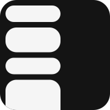

<h1 align="center" >  The Stack</h1>

  <a href="https://thestack.cl">thestack.cl</a>

The Stack es un índice de contenido techie (y no tanto) para Latinoamérica.

- tu sideproject?
- tu último blog?
- la noticia de que X levantó Y billions?
- el meetup sobre A que organizaste en B? 
- lo que John Doe dijo sobre Foo Bar hace una década

Queremos crear un espacio donde el contenido humano, original y de calidad tenga un lugar para las mentes curiosas de latam

*Save the internet.*

---

## The Tech Stack

| Capa | Tecnología |
|------|------------|
| Frontend | SvelteKit + TailwindCSS |
| Backend | Hono (Cloudflare Workers) |
| Base de datos | Cloudflare D1 (SQLite) |
| Auth | Better Auth |
| ORM | Drizzle |

Todo corre en el edge de Cloudflare. Serverless.

## Cómo Contribuir

### Haciendo comunidad

- **Crea contenido**: Escribe blogs, construye proyectos, comparte tu conocimiento
- **Comparte en the stack**: Sube lo que haz hecho o lo que ha hecho alguien que admiras y/o un amigo

Haz mover la rueda de nuestra industria en Latam

### Reportando issues

- Abre tickets de bugs o problemas que encuentres
- Sugiere nuevas features o mejoras

### Contribuyendo código

- ~~Vibecodea~~ Desarrolla, siguiendo el roadmap

---

## Roadmap

- Reportes: sobre posts que no cumplan las normas ni lineamientos
- Post endpoint: habilitar un ep para postear, automatizaciones, etc
- Posts en redes sociales
- RSS
- ~~Newsletter~~
- ~~DARK MODE~~
- ~~Comentarios: al igual que HN, discutir sobre un post~~

---

  <a href="https://thestack.cl">thestack.cl</a>

  apoyado por  <a href="https://indies.cl">indies.cl</a>

